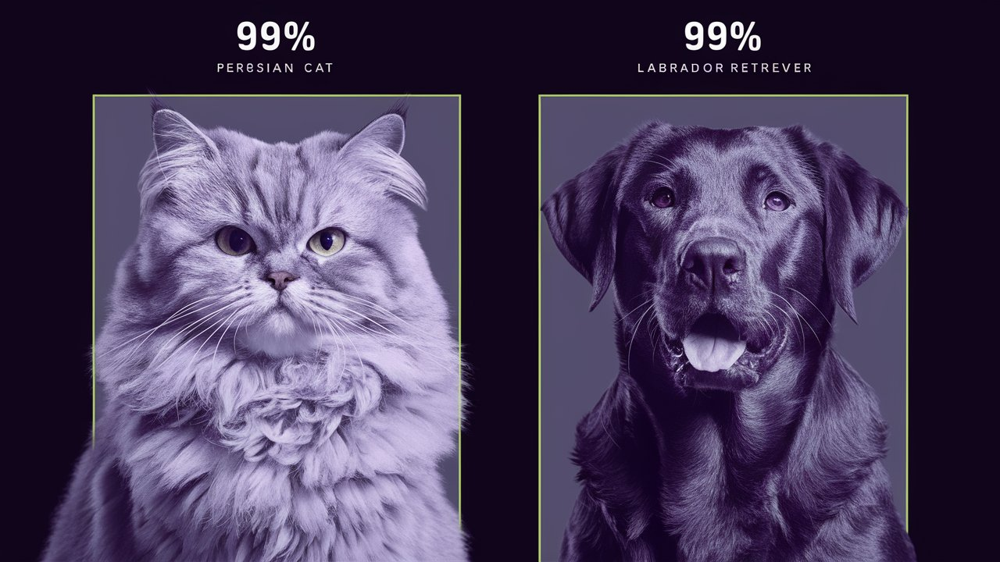

# 📚 Desarrollo de una Red Neuronal Profunda para la deteccion de razas de perros y gatos.

## 📖 Descripción del Proyecto
Este proyecto detectar la raza de las siguientes razas de perro: 
- Labrador
- Husky
- Chihuhua

Para las razas de Gatos son las siguientes:
- Siames
- Persa

A traves de un sitio web creada con Streamlit se puden cargar imagnes o tambien se puede detectar en tiempo real activando la camara web.

---

## 🚀 Características Principales
- **Cargar de imagenes:** Puedes cargar imagenes para detectar la raza de tu mascota.
- **Detección en Tiempo Real:** Puedes activar tu webcam para detectar la raza de tu mascota.

---

## 🛠️ Tecnologías Utilizadas
- **Backend:** Python, Streamlit
- **Modelos:** Yolo V8
- **Frontend:** HTML, CSS
- **Entrenamiento del modelo:** JupyterLab
